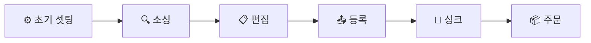
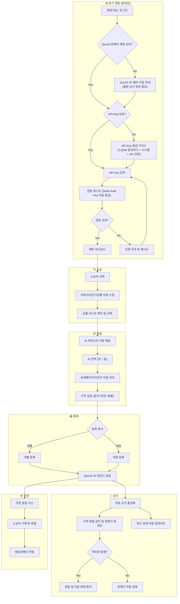

# 솔루션 제안서(RFP)

---

---

## 1. 프로젝트 개요

### 1-1. 배경

DayZero는 현재 B2B 엔터프라이즈 고객(연매출 300억 이상)을 대상으로 크로스보더 자동화 솔루션을 운영 중이다. 1차 검증 프로젝트(2026.01~03)를 통해 **8건의 셀러 인터뷰**를 수행한 결과, 역직구 개인 셀러의 소싱→등록→관리 파이프라인에 **명확한 Pain이 존재하며 솔루션에 대한 수요가 검증**되었다.

투트랙 이규환 님과의 파트너십을 통해 구체적인 제품 방향(Q10JP 연동, 상품 번들링), 수익 분배 조건, 사용자 모집 경로까지 확보한 상태이다.

### 1-2. 목적

본 프로젝트의 목적은 **역직구 개인 셀러를 위한 B2C SaaS 솔루션(DayZero B2C)의 1차 디자인 및 프로토타입 제작**이다.

1. 검증된 셀러 Pain을 해결하는 핵심 기능 명세를 정의한다
2. 바이브 코딩 기반 프로토타입 제작의 기초가 되는 구체적인 기획안을 수립한다
3. MVP 범위를 확정하고 개발 우선순위를 제시한다

### 1-3. 범위

- **타겟 마켓**: Qoo10 JP (1차), Qoo10 SG (확장 예정)
- **타겟 사용자**: 위탁/구매대행 경험이 있는 한국 온라인 셀러
- **핵심 파이프라인**: 소싱 → 상품 등록 → 가격/재고 싱크 → 주문/배송 관리
- **MVP 1차 범위**: 상품 소싱 + 상품 등록
- **제외 범위**: UX 설계 기준(별도 Stroke 진행), B2B 기능, 쇼피파이 연동(기존 완료)

### 1-4. 일정

| **단계** | **내용** | **목표 기한** |
| --- | --- | --- |
| RFP 작성 | 프로젝트 제안서 완성 | 2026.03.05 |
| UX 설계 기준 정리 | 사용성 설계 원칙 수립 | TBD (별도 Stroke) |
| 킥오프 미팅 | 온꿈사 팀 피드백 반영 | 2026.03.06 |
| 프로토타입 제작 | 바이브 코딩 기반 데모 | 2026.03 중 |

## 2. 시장 검증 결과

> 1차 검증 프로젝트(2026.01~03)에서 **8건의 셀러 인터뷰 + 2건의 강사 미팅**을 통해 도출된 핵심 발견을 요약한다.
> 

### 2-1. 셀러 규모별 Pain 포인트

| **셀러 유형** | **핵심 Pain** | **근거** |
| --- | --- | --- |
| **초보 셀러** | 잘 팔리는 제품을 소싱하는 것 자체가 어려움 | 트렌드·정책에 맞는 제품 찾기가 핵심 고충. 반복 작업은 규모가 작아 부담 적음 |
| **중급 셀러** | 상품 등록(리스팅)이 가장 시간 소모 | 하루 10개 목표이나 수동 시 5개도 힘듦. 사진 작업·번역이 핵심 병목 |
| **숙련 셀러** | 소싱처의 복잡한 할인 구조 추적에 업무 시간 80% 이상 | 쿠폰·카드사·1+1 등 실질 구매가 추적이 수익의 핵심 |

<aside>
💡

**시사점** — 솔루션은 셀러 성장 단계별로 다른 가치를 제공해야 한다. 초보에게는 **소싱·리스팅 자동화**, 중급·숙련에게는 **가격 추적·마진 최적화**.

</aside>

### 2-2. 가격 수용도

| **인터뷰이** | **월 15만원 반응** | **근거** |
| --- | --- | --- |
| 엄승재 님 (초보) | 🔴 부정 | 반복 작업 규모가 작아 납득 불가. 범용 AI 툴(3만원대) 대비 기능 우위 필요 |
| 윤이서 대표님 (초보 부업) | 🟢 긍정 | 셀잇파파(500개 기준 ~30만원/월) 대비 저렴. 합리적 |
| 박정훈 님 (숙련) | 🟡 조건부 긍정 | 올리브영 가격 추적 특화 시 월 20만원대도 수용. 특화 플랜에 가치 |

<aside>
💡

**시사점** — 초보 셀러에게는 **저가 진입 플랜**, 숙련 셀러에게는 **특화 기능 플랜**으로 가격 모델을 이원화하는 전략이 유효하다.

</aside>

### 2-3. 파트너십 검증

| **가설** | **결과** | **근거** |
| --- | --- | --- |
| 커미션 보상 → 강사 자발적 홍보 | ✅ 검증 | 투트랙 님: 수익 쉐어에 적극 반응, 유튜브 대량 제작·1,000~2,000명 목표 |
| 강사 피드백 → 솔루션 완성도 향상 | ✅✅ 초과 | Q10JP 연동, 상품 번들링, 소싱 사이트별 가격 차등 모델 등 구체적 방향 제시 |
| 수강생 수동 작업 중도 포기 인지 | ✅ 검증 | 양쪽 강사 모두 수동 작업 고통을 일상적으로 목격 |

## 3. 타겟 사용자 정의

### 3-1. 핵심 페르소나

<aside>
👤

**Primary Persona** — 위탁/구매대행 경험이 있는 한국 온라인 셀러

- **매출 규모**: 일 매출 30~35만원 (월 ~1,000만원)
- **주요 마켓**: Qoo10 JP (주력)
- **운영 형태**: 1인 또는 소규모 팀 운영
- **기술 수준**: 엑셀 관리 중심, 크롬 익스텐션(셀럽픽 등) 사용 경험
- **핵심 고충**: 소싱→등록 과정의 반복 수작업, 재고/가격 불일치로 인한 역마진
</aside>

### 3-2. 셀러 성장 단계별 니즈

| **단계** | **월 매출** | **핵심 니즈** | **솔루션이 제공할 가치** |
| --- | --- | --- | --- |
| **초보** | ~300만원 | 잘 팔리는 상품 발굴 | 카테고리/인기상품 자동 수집, 트렌드 데이터 |
| **중급** | 300~1,000만원 | 빠른 리스팅, 사진/번역 자동화 | 원클릭 등록, AI 번역, 이미지 자동 처리 |
| **숙련** | 1,000만원+ | 실질 구매가 추적, 마진 최적화 | 실시간 가격 싱크, 역마진 방어, 번들링 |

## 4. 핵심 기능 — 소싱

### 4-1. 기능 요구사항

| **기능** | **설명** | **수집 방식** | **우선순위** | **근거** |
| --- | --- | --- | --- | --- |
| **URL 입력 수집** | 셀러가 소싱처 상품 URL을 직접 입력하면 상품 정보(상품명, 이미지, 가격, 옵션, 상세페이지)를 자동 파싱하여 수집 | 수동 입력 → 자동 파싱 | 🔥 최우선 | 기획 회의: 소싱 파이프라인 시작점. 셀러가 원하는 특정 상품을 즉시 가져올 수 있는 기본 수집 경로 |
| **전자동 크롤링** | 소싱처별 카테고리/인기상품을 RPA가 자동으로 수집하여 셀러에게 추천. 셀러는 수집된 리스트에서 원하는 상품을 선택 | 전자동 (RPA) | 🔥 최우선 | 경쟁사 리서치 MVP 원칙 ①: 카테고리/인기상품 자동 수집이 DayZero 3대 차별화 요소 |
| **상품 번들링** | 여러 소싱처의 상품을 조합하여 기획 상품 구성 (예: 산리오 세트, 화장품 큐레이션) | 수동 조합 | 중장기 | 투트랙 인터뷰: 치킨게임 방지, 셀러 차별화 |
| **소싱처 확장** | 시크릿 연동 사이트(커스터마이징) 제공 | — | 중장기 | 투트랙 인터뷰: 소싱 사이트 기반 가격 차등화 |

### 4-2. 지원 소싱처 (MVP)

> 기존 B2B RPA 솔루션에서 이미 연동 완료된 소싱처를 MVP 기본 지원 대상으로 포함한다.
> 

| **소싱처** | **카테고리 특성** | **비고** |
| --- | --- | --- |
| 올리브영 ([oliveyoung.com](http://oliveyoung.com)) | 뷰티/화장품 | 가격 구조 복잡(쿠폰/카드사/1+1), 숙련 셀러 핵심 소싱처 |
| 쿠팡 ([coupang.com](http://coupang.com)) | 종합 | 다양한 카테고리 커버, 국내 최대 이커머스 |
| 네이버 스마트스토어 ([smartstore.naver.com](http://smartstore.naver.com)) | 종합 | 국내 최대 오픈마켓 |
| G마켓 ([gmarket.co.kr](http://gmarket.co.kr)) | 종합 | 국내 주요 오픈마켓, 다양한 프로모션 |
| 다이소 ([daisomall.co.kr](http://daisomall.co.kr)) | 생활용품/잡화 | 저가 생활용품, 일본 역직구 수요 높음 |
| yes24 ([yes24.com](http://yes24.com)) | 도서/음반/굿즈 | K-POP 앨범·굿즈 소싱 |
| 알라딘 ([aladin.co.kr](http://aladin.co.kr)) | 도서/음반/굿즈 | K-POP 앨범·포토카드 소싱 |
| Ktown4u ([ktown4u.com](http://ktown4u.com)) | K-POP/엔터 | K-POP 전문 글로벌 플랫폼, 팬덤 상품 |
| 위버스샵 ([shop.weverse.io](http://shop.weverse.io)) | K-POP/엔터 | 하이브 아티스트 공식 굿즈 |
| 메이크스타 ([makestar.com](http://makestar.com)) | K-POP/엔터 | 아이돌 굿즈·포토카드 펀딩 |
| 위치폼 ([witchform.com](http://witchform.com)) | 뷰티/스킨케어 | 자연주의 화장품 브랜드 |
| FANS ([app.fans](http://app.fans)) | K-POP/엔터 | 팬덤 커머스 플랫폼 |

### 4-3. 경쟁사 소싱 방식 비교

| **솔루션** | **소싱 방식** | **DayZero 차별점** |
| --- | --- | --- |
| 투플렉스 | 수동 URL 입력 또는 1688 기반 | 국내 소싱처 다양성 부족 |
| 셀러픽 | 크롬 익스텐션 + URL 복붙 | 소싱 경로 파편화, 자동 수집 미지원 |
| 윈들리 | 수동 입력 중심 | 자동화 수준 낮음 |
| 퍼센티 | 카테고리 검색 기반 | 국내 소싱처 제한적 |
| 셀잇파파 | 엑셀 대량 등록 | 소싱 자체는 수동 |
| Q10 Auto | 크롬 익스텐션 + AI 랭킹 자동 수집 (쿠팡/올리브영/무신사/다이소) | Q10JP 단일 마켓 전용, 다마켓 확장 불가 |
| **DayZero** | **URL 입력 수집 + RPA 전자동 크롤링** | 소싱: RPA 크롤링 / 등록: Qoo10 API. 새 사이트 연동 3~4일 |

## 5. 핵심 기능 — 상품 등록

> 기획 회의 및 인터뷰 결과, **상품 등록(업로드) 기능이 셀러가 가장 먼저 필요로 하는 최우선 기능**으로 확인되었다.
> 

### 5-1. 기능 요구사항

| **기능** | **설명** | **우선순위** | **근거** |
| --- | --- | --- | --- |
| **원클릭 상품 등록** | 소싱된 상품을 Qoo10 JP에 버튼 한 번으로 업로드 | 🔥 최우선 | 기획 회의 + 투트랙: 업로드가 1순위 |
| **AI 카테고리 매칭** | 국내 카테고리 → Qoo10 JP 카테고리 자동 매핑 | 🔥 최우선 | 중급 셀러 핵심 병목 해소 |
| **AI 번역** | 상품명, 상세페이지, 옵션명 자동 번역(한→일) | 🔥 최우선 | 기획 회의: ChatGPT+제미나이 활용, Papago/DeepL 검수 |
| **상세페이지 자동 변형** | 이미지 내 텍스트 번역, 레이아웃 최적화 | 높음 | 투트랙: 상세페이지 변형이 잘 되어야 함 |
| **가격 자동 설정** | 원가 + 마진율 + 환율 기반 판매가 자동 계산 | 높음 | 기획 회의: 마진율 5~10%, 환율 실시간 반영 |
| **대량 등록** | 다수 상품 일괄 업로드 | 높음 | 중급 셀러: 하루 10개 목표이나 수동 시 5개도 힘듦 |
| **이미지 자동 처리** | 배경 제거, 리사이즈, 워터마크 등 | 보통 | 등록 프로세스 자동화의 일환 |

### 5-2. 등록 대상 마켓

| **마켓** | **우선순위** | **근거** |
| --- | --- | --- |
| **Qoo10 JP** | 🔥 1순위 | 투트랙: 동남아 대비 일본 시장 기회가 더 큼. B2C 오픈마켓이 핵심 |
| Qoo10 SG | 2순위 | 기획 회의: 확장 예정 |
| Shopee | 3순위 | 투트랙: 쇼피는 무너진 상황이나 동남아 인구 규모 고려 |
| eBay | 4순위 | 투트랙 커리큘럼에 포함 |

## 6. 핵심 기능 — 가격·재고·주문 관리

### 6-1. 가격/재고 관리

| **기능** | **설명** | **우선순위** | **근거** |
| --- | --- | --- | --- |
| **실시간 가격 싱크** | 소싱처 가격 변동 → 판매 마켓 가격 자동 반영 | 🔥 높음 | 경쟁사 리서치 MVP 원칙 ②, 투트랙: 가격 싱크 3순위 |
| **재고 자동 동기화** | 소싱처 재고 상태 → 판매 마켓 재고 자동 업데이트 | 🔥 높음 | 기획 회의: 재고 확인 빈도 하루~일주일 1회 → 자동화 필요 |
| **역마진 방어** | 실시간 역마진 판단 및 알림, 자동 판매 중지 | 높음 | 투트랙: 역마진을 실시간으로 판단할 수 있어야 함 |
| **마진 계산기** | 원가 + 수수료 + 배송비 + 환율 기반 손익 계산 | 높음 | 투트랙: 손익(마진) 계산 필수 |
| **환율 자동 반영** | 실시간 환율 데이터 연동 | 높음 | 기획 회의: 환율 변동이 마진에 직접 영향 |

### 6-2. 주문/배송 관리

| **기능** | **설명** | **우선순위** | **근거** |
| --- | --- | --- | --- |
| **주문 확인** | Qoo10 JP 주문 알림 및 대시보드 | 보통 (4순위) | 투트랙: 주문 확인 기능 제시 |
| **국내 사이트 구매 연동** | 주문 시 소싱처 구매 창 자동 띄우기 | 보통 | 투트랙: "구매 창 띄워주는 정도" |
| **배송대행사 연동** | 링코스, 퓌익스프레스 등 배송대행사 API 연동 | 낮음 (5순위) | 투트랙: 배송 연동은 후순위 |

## 7. 경쟁사 분석 및 차별화 전략

### 7-1. 경쟁사 핵심 비교

| **항목** | **투플렉스** | **셀러픽** | **윈들리** | **퍼센티** | **셀잇파파** | **Q10 Auto** |
| --- | --- | --- | --- | --- | --- | --- |
| **소싱** | 수동 URL / 1688 | 크롬 익스텐션 | 수동 입력 | 카테고리 검색 | 엑셀 대량 | AI 랭킹 자동 수집 |
| **등록** | UI 편리, 다마켓 | 대량 등록 | 기본 등록 | 카테고리 매칭 | 엑셀→마켓 | 크롬 익스텐션 원클릭 |
| **가격/재고** | ✅ 싱크 우수 | ❌ 미약 | ❌ 미약 | △ 부분 지원 | ❌ 미약 | ❌ 미약 |
| **강점** | UI 편의성, 가격/재고 싱크 | 접근성(크롬 익스텐션) | 직관적 UI | 카테고리 분류 | 대량 등록 속도 | Q10JP 완전 특화, 소싱→상세페이지→등록 풀 자동화, 약사법 금칙어 필터링 |
| **약점** | 국내 소싱처 제한 | 소싱 경로 파편화 | 자동화 수준 낮음 | 마켓 커버리지 제한 | UI 복잡 | Q10JP 단일 마켓만 지원, 가격/재고 싱크 부재, 확장성 제한 |

### 7-2. DayZero 3대 차별화 원칙

<aside>
1️⃣

**카테고리/인기상품 자동 수집**

기존 솔루션은 셀러가 상품을 직접 검색·선택하는 반자동. DayZero는 RPA 기반으로 소싱처에서 카테고리별 인기상품을 **자동 수집**하여 셀러의 소싱 시간을 단축.

</aside>

<aside>
2️⃣

**쉬운 사용성**

4개 솔루션 모두 정보 과부하 문제를 안고 있음. 한 화면에 소싱/가공/등록/재고 관련 데이터가 한꺼번에 노출되어 초보 셀러 진입 장벽이 높음.

**DayZero는 인지 부하 해소, 창 전환 최소화, 즉각 피드백 등을 토대로 사용성을 개선.**

</aside>

<aside>
3️⃣

**매일 자동 재고/가격 동기화**

경쟁사 대부분은 가격/재고 싱크가 미약하거나 수동. DayZero는 하루마다 **자동 동기화**를 제공하여 역마진과 재고 불일치를 원천 차단.

</aside>

### 7-3. 추가 차별화 요소

- **상품 번들링**: 여러 소싱처의 상품을 조합하여 기획 상품 구성 (예: 산리오 캐릭터 세트, 화장품 큐레이션 패키지) → 가격 경쟁 회피, 셀러 창의성 발휘
- **RPA 기술 기반**: 크롤링이 아닌 소프트웨어 로봇이 사람처럼 작업 → 새 사이트 연동 3~4일, AI 활용으로 속도 개선 중
- **소싱 사이트 기반 가격 모델**: 상품 등록 수가 아닌 접근 가능한 소싱 사이트로 가격 차등화 → 소싱 사이트가 많을수록 가치 증가

## 8. 핵심 화면 흐름도

### 8-1. 전체 파이프라인 개요

### 8-2. 상세 화면 흐름도

## 9. 기술 요구사항 및 마일스톤

### 9-1. 기능별 기술 요건

| **기능** | **기술 요건** | **비고** |
| --- | --- | --- |
| 소싱 자동 수집 | RPA 엔진, 웹 스크래핑 | 기존 B2B RPA 기술 활용 가능 |
| AI 카테고리 매칭 | LLM API (GPT/Gemini), 카테고리 매핑 DB | 국내↔Qoo10 JP 카테고리 매핑 테이블 필요 |
| AI 번역 | LLM API + Papago/DeepL 검수 레이어 | 기획 회의: 이중 검수 구조 권장 |
| 상세페이지 변형 | 이미지 OCR + AI 번역 + 이미지 편집 API | 이미지 내 텍스트 처리 핵심 |
| 가격 설정 | 환율 API (실시간), 마진 계산 로직 | 수수료 구조 마켓별 상이 |
| Qoo10 JP 등록 | Qoo10 Open API 연동 | API 방식 확정. RPA는 소싱 크롤링에만 사용 |
| 가격/재고 싱크 | 스케줄러(cron), 소싱처 모니터링 | 일 1회 이상 자동 실행 |
| 주문 관리 | Qoo10 주문 API, 알림 시스템 | 후순위 개발 |
| 배송대행사 연동 | 링코스/퓌익스프레스 API | 중장기 개발 |

### 9-2. 핵심 기능 우선순위 종합

| **순위** | **기능** | **Phase** | **근거** |
| --- | --- | --- | --- |
| 1 | Q10JP 상품 소싱 + 등록 | Phase 1 | 기획 회의 + 투트랙: 업로드가 최우선. 오픈마켓 연동 필수 |
| 2 | 재고/가격 실시간 싱크 | Phase 1 | 3순위. 역마진 방어가 비즈니스 지속성에 필수 |
| 3 | AI 번역 + 카테고리 매칭 | Phase 2 | 중급 셀러 핵심 병목 해소. 등록의 핵심 구성 요소 |
| 4 | 주문 관리 | Phase 3 | 현재는 구매 창 띄워주는 수준 |
| 5 | 배송대행사 연동 | Phase 3 | 링코스/퓌익스프레스. 후순위 |
| 6 | 상품 번들링 | Phase 3+ | 추가 기술 개발 + 법적 검토 선행 필요 |