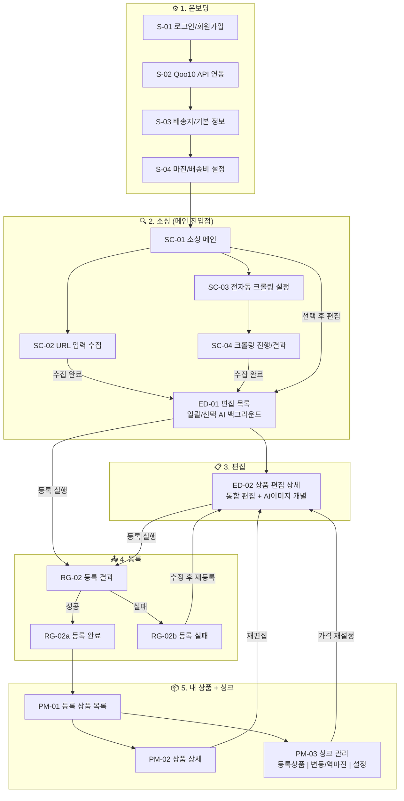

# IA 구조 설계

## 📋 IA 구조 설계서

<aside>
📌

**문서 상태**: 초안 (디렉터 리뷰 대기) · **범위**: MVP Phase 1, Phase 2 (소싱 + 등록 + 싱크 + AI 편집)

</aside>

---

### 📐 IA 설계 기준

1. **파이프라인 기반 분류** — 초기 셋팅 → 소싱 → 편집 → 등록 → 싱크 순서로 화면 배치
2. **UX 4대 원칙** — 지금 해야 할 것만 강조 · 시스템 선처리+셀러 최종 확인 · 명확한 피드백 · 에러 시 해결책
3. **셀러 성장 단계별 진입** — 초보(전자동 추천) / 중급(URL 입력) / 숙련(대량 등록)
4. **경쟁사 Pain Point 반영** — 정보 과부하 해소, 파이프라인별 화면 분리

---

### 🖥️ 전체 화면 계층 (Total 22화면)

```jsx
DayZero B2C
├── 0. 공통 (Global)
│   ├── G-01  GNB (글로벌 네비게이션)
│   └── G-02  시스템 알림
│
├── 1. 온보딩/초기 셋팅
│   ├── S-01  로그인/회원가입
│   ├── S-02  Qoo10 JP API 연동
│   ├── S-03  배송지/기본 정보
│   └── S-04  마진/배송비 설정
│
├── 2. 소싱
│   ├── SC-01 소싱 홈 (자동화 현황)
│   ├── SC-02 URL 입력 수집
│   ├── SC-03 자동 수집 설정
│   └── SC-04 수집 진행/결과
│
├── 3. 편집 (상품 가공)
│   ├── ED-01 편집 목록 (상태 탭: 전체 · 번역 필요 · 편집 완료)
│   │   └── ED-01a AI 번역 (한→일)
│   └── ED-02 상품 편집 상세
│       ├── ED-02a 통합 편집
│       ├── ED-02b 썸네일 AI 설정
│       └── ED-02c 상세페이지 AI 설정
│
├── 4. 등록 (ED-01/ED-02에서 직접 등록)
│   └── RG-02 등록 결과
│       ├── RG-02a 등록 완료
│       └── RG-02b 등록 실패
│
├── 5. 내 상품
│   ├── PM-01 등록 상품 목록
│   ├── PM-02 상품 상세 (등록 후)
│   └── PM-03 싱크 관리 (등록상품 | 변동/역마진 | 설정)
│
└── 6. 설정
    ├── ST-01 계정 관리
    ├── ST-02 Qoo10 연동 관리
    ├── ST-03 소싱/등록 기본 설정
    └── ST-04 알림 설정
```

---

### 0. 공통 (Global)

| **화면 ID** | **화면명** | **포함 요소** | **이동 경로** | **자동화** |
| --- | --- | --- | --- | --- |
| G-01 | **GNB** | 로고 · 메인 메뉴(소싱·편집·등록·내 상품·설정) · 알림 아이콘(미독 수 뱃지) · 사용자 프로필 | 모든 화면 상단 고정 | — |
| G-02 | **시스템 알림** | 알림 리스트(크롤링 완료 · 등록 성공/실패 · 싱크 변동/역마진) · 읽음/안읽음 · 해당 화면 바로가기 | G-01 알림 아이콘 클릭 → 패널 | 자동 |

---

### 1. 온보딩/초기 셋팅

<aside>
💡

**설계 의도**: 최초 1회만 거치는 셋업 플로우. 시스템이 추천값을 선제시 → 셀러 확인 (UX 원칙 ②: 시스템 선처리)

</aside>

| **화면 ID** | **화면명** | **포함 요소** | **이동 경로** | **자동화** |
| --- | --- | --- | --- | --- |
| S-01 | **로그인/회원가입** | 이메일 입력 · 비밀번호 · 소셜 로그인(Google/Kakao) · 회원가입 폼 · 이용약관 동의 | 앱 최초 진입 → S-01 | 수동 |
| S-02 | **Qoo10 JP API 연동** | API Key 입력 필드 · 발급 가이드 링크(J-QSM > 시스템 > API 권한) · 연동 테스트 버튼 · 성공/실패 피드백 · Seller Auth Key 자동 발급 표시 · 실패 시 에러 사유 + 재시도 | S-01 로그인 → S-02 (최초 1회) | 반자동 (Key 입력 → 검증 자동) |
| S-03 | **배송지/기본 정보** | 배송지 주소 입력 · 반품 주소 · 기본 연락처 · 사업자 정보(해당 시) · 시스템 추천값 선제시 | S-02 연동 성공 → S-03 | 반자동 (추천값 → 셀러 확인) |
| S-04 | **마진/배송비 설정** | 기본 마진율(%) · 기본 배송비(국제배송 기본값) · Qoo10 수수료 기본값 · 마진 시뮬레이션 미리보기 · 시스템 추천값 선제시 | S-03 완료 → S-04 | 반자동 (추천값 → 셀러 확인) |

---

### 2. 소싱 - 메인 진입점

<aside>
💡

**설계 의도**: 대시보드 없이 소싱 화면이 로그인 후 기본 랜딩. 초보는 전자동 크롤링으로 상품 발견, 중급은 URL 직접 입력으로 빠른 수집.

</aside>

| **화면 ID** | **화면명** | **포함 요소** | **이동 경로** | **자동화** |
| --- | --- | --- | --- | --- |
| SC-01 | **소싱 메인** | 수집 상품 전체 리스트(URL+크롤링 통합) · 상단 탭(URL 수집 / 전자동 크롤링) · 필터(소싱처·카테고리·수집일·상태) · 정렬(최신순·가격순) · 선택 → "편집으로 이동" 버튼 · 전체/개별 체크박스 | 로그인 후 기본 랜딩 / GNB "소싱" | — |
| SC-02 | **URL 입력 수집** | URL 입력 필드(단일/복수) · 소싱처 자동 감지 표시(로고+사이트명) · 수집 시작 버튼 · 수집 프로그레스 · 수집 결과 미리보기(상품명·이미지·가격·옵션 수) · 지원 소싱처 12개 안내 | SC-01 → "URL 수집" 탭 | 반자동 (URL 입력 → 파싱 자동) |
| SC-03 | **전자동 크롤링 설정** | 소싱처 선택(12개 사이트 체크박스) · 카테고리 선택(소싱처별 트리) · 수집 조건(인기순/신상품/가격대) · 수집 수량 설정 · 크롤링 시작 버튼 | SC-01 → "전자동 크롤링" 탭 → "새 크롤링" | 전자동 (설정 후 RPA 실행) |
| SC-04 | **크롤링 진행/결과** | 상태(대기/진행중/완료/실패) · 수집 상품 수 실시간 카운트 · 예상 소요시간 · 완료 시 결과 리스트 · 실패 시 에러 사유 + 재시도 | SC-03 크롤링 시작 → SC-04 | 자동 (RPA 실행 결과) |

---

### 3. 편집 (상품 가공)

<aside>
💡

**설계 의도**: ED-01 리스트에서 상품 **선택/일괄** → AI 번역·카테고리·가격을 **백그라운드 실행**(원하는 항목만 개별 실행도 가능). ED-02 상세에서 결과 확인 + 셀러 직접 수정. AI 이미지 번역은 무거운 작업이므로 ED-02 안에서 **개별 실행**. (UX 원칙 ①: 지금 해야 할 것만 · ②: 시스템 선처리 + 셀러 최종 확인)

</aside>

| **화면 ID** | **화면명** | **포함 요소** | **이동 경로** | **자동화** |
| --- | --- | --- | --- | --- |
| ED-01 | **편집 목록** | 편집 필요 상품 리스트 · 상태(**미처리 / AI처리중 / AI완료 / 편집완료**) · 전체/개별 체크박스 · **AI 번역 탭**(ED-01a) · 일괄/선택 AI 백그라운드 실행 · AI 처리 진행률 실시간 표시(처리중/완료/실패) · 필터/정렬 · 선택 → "등록 실행" | GNB "편집" / SC-01에서 선택 후 "편집" | 반자동 (선택/일괄 → 백그라운드) |
| ED-01a | **AI 번역** | 선택 상품에 AI 번역(한→일) 백그라운드 실행 · 상품명·상세설명·옵션명 일괄/선택 번역 · 진행률 표시 · *(제공 방식 추후 확정)* | ED-01 내 탭 | 자동 (백그라운드) |
| ED-02 | **상품 편집 상세** | **[상단 고정] 상품 요약**: 썸네일 · 원문 상품명 · 소싱처 · 브랜드/제조사/원산지(읽기 전용) · AI 처리 상태 · **탭 3개**(ED-02a~c) · "등록 대기로 보내기" · "이전/다음 상품" 네비 | ED-01에서 상품 클릭 → ED-02 | 반자동 |
| ED-02a | **통합 편집** | **번역**: 상품명·상세설명·옵션명 원문(한)/번역문(일) 좌우 비교 · 엔진 표시(GPT/Gemini → Papago 검수) · 셀러 직접 수정
**카테고리**: 국내 → Qoo10 JP AI 추천(상위 3개) · 카테고리 트리 수동 선택 · 매칭 신뢰도(%) · 셀러 변경
**가격**: 원가·마진율(%)·환율·Qoo10 수수료·국제 배송비 → 최종 판매가 자동 계산 · 마진 시뮬레이션 · 셀러 마진율 조정
**옵션**: 옵션 목록(번역 완료) · 가격 차등 · 재고 · 추가/삭제 · 셀러 직접 편집 | ED-02 내 탭 (기본 탭) | 반자동 (AI 결과 확인 + 셀러 수정) |
| ED-02b | **썸네일 AI 설정** | 대표 이미지 선택/순서 · **"AI 이미지 번역" 개별 실행**(OCR+번역+재합성 — 토큰/시간 소요 큼) · 번역 전/후 비교 · 리사이즈/배경 제거 · 셀러 확인/수정 | ED-02 내 탭 | 반자동 (AI 개별 실행 → 셀러 확인) |
| ED-02c | **상세페이지 AI 설정** | 상세페이지 이미지 목록 · **"AI 상세페이지 번역" 개별 실행**(OCR+번역+재합성) · 번역 전/후 비교 미리보기 · 이미지 순서/삭제 · 셀러 확인/수정 | ED-02 내 탭 | 반자동 (AI 개별 실행 → 셀러 확인) |

---

### 4. 등록

<aside>
💡

**설계 의도**: Qoo10 Open API로 등록. 필수 항목 미충족 시 등록 차단 + 해당 편집 화면 바로가기 (UX 원칙 ④: 에러 시 해결책)

</aside>

| **화면 ID** | **화면명** | **포함 요소** | **이동 경로** | **자동화** |
| --- | --- | --- | --- | --- |
| RG-02 | **등록 결과** | 등록 처리 완료 상품 통합 리스트 · **탭 2개**(RG-02a 완료 / RG-02b 실패) | ED-01/ED-02 등록 완료 후 / GNB "등록" → 결과 탭 | — |
| RG-02a | **등록 완료** | 성공 상품 리스트 · Qoo10 JP 상품 URL 링크 · 등록 일시 · "내 상품" 이동 | RG-02 내 탭 | — |
| RG-02b | **등록 실패** | 실패 상품 리스트 · 에러 코드 + 사유(API 응답) · 항목별 해결 가이드 · "수정 후 재등록" → ED-02 · 재등록 버튼 | RG-02 내 탭 | — |

---

### 5. 내 상품 (등록 상품 + 싱크)

<aside>
💡

**설계 의도**: 등록된 상품 관리와 싱크(재고/가격 동기화)를 "내 상품" 안에서 통합. PM-01에서 전체 현황, PM-03에서 변동 건 모아보기 + 싱크 주기/임계값 설정. 알림(노티)은 G-02에서 처리.

</aside>

| **화면 ID** | **화면명** | **포함 요소** | **이동 경로** | **자동화** |
| --- | --- | --- | --- | --- |
| PM-01 | **등록 상품 목록** | Qoo10 JP 등록 상품 전체 · 상태(판매중/중지/품절) · 싱크 상태 표시(정상/변동/에러) · 필터(상태·소싱처·등록일·싱크상태) · 판매 중지/재개 토글 · "싱크 관리" 이동(PM-03) | GNB "내 상품" / RG-02a 이동 | — |
| PM-02 | **상품 상세 (등록 후)** | Qoo10 등록 정보 요약 · 원본 소싱 정보 · 현재 판매가/마진율 · Qoo10 상품 페이지 링크 · "재편집" → ED-02 | PM-01 상품 클릭 → PM-02 | — |
| PM-03 | **싱크 관리** | 싱크 대상 등록 상품 통합 관리 · **탭 3개**(PM-03a~c) | PM-01 → "싱크 관리" / GNB "내 상품" → PM-03 | — |
| PM-03a | **싱크 등록 상품** | 정상 싱크 중인 상품 리스트 · 소싱처 현재가 vs Qoo10 판매가 비교 · 재고 상태(정상) · 마지막 싱크 시간 · 싱크 주기 표시 · 상품 클릭 → PM-02 | PM-03 내 탭 (기본 탭) | 자동 (주기적 크롤링 결과 표시) |
| PM-03b | **변동/역마진/품절** | **조치 필요 상품만 모아보기** · 역마진 발생(원가 상승/환율 변동) · 품절 감지 · 재고 부족 · 자동 조치 내역(판매중지/가격 재계산) · 수동 확인 필요 건 하이라이트 · "가격 재설정" → ED-02 · "판매 중지/재개" 토글 · 재등록 버튼 | PM-03 내 탭 | 자동 (감지) + 반자동 (셀러 조치) |
| PM-03c | **싱크 설정** | 자동 싱크 주기(1h/6h/12h/24h) · 역마진 임계값(%) 설정 · 품절 시 자동 판매중지 On/Off · 가격 변동 자동 반영 범위(±N%) · 싱크 대상 소싱처 선택 · 환율 변동 반영 기준 | PM-03 내 탭 | 반자동 (설정 후 시스템 자동 실행) |

---

### 6. 설정

| **화면 ID** | **화면명** | **포함 요소** | **이동 경로** | **자동화** |
| --- | --- | --- | --- | --- |
| ST-01 | **계정 관리** | 이메일 · 비밀번호 변경 · 프로필 · 구독 플랜 확인 | GNB 프로필 → ST-01 | 수동 |
| ST-02 | **Qoo10 연동 관리** | API Key 확인/변경 · 연동 상태 · 재연동 테스트 · Seller Auth Key 확인 | GNB 설정 → ST-02 | 반자동 |
| ST-03 | **소싱/등록 기본 설정** | 기본 마진율 · 기본 배송비 · Qoo10 수수료 · 환율 기준 · AI 번역 엔진 선택 · 자동 크롤링 주기 | GNB 설정 → ST-03 | 수동 |
| ST-04 | **알림 설정** | 크롤링 완료 알림 On/Off · 등록 성공/실패 알림 · 싱크 변동/역마진 알림 On/Off · 채널 선택(인앱 / 이메일 / Slack) · Slack 워크스페이스 연동 + 알림 채널 지정 | GNB 설정 → ST-04 | 수동 |

---

### 📈 화면 흐름도

