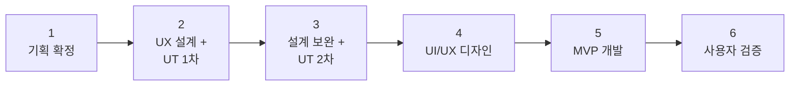

# 프로젝트 완료 기준

---

---

## 프로젝트 완료 기준

> 본 프로젝트(크로스보더 B2C 솔루션 1차 MVP)의 완료 기준은 **DayZero B2C MVP(상품 소싱 + 상품 등록 + 가격/재고 싱크)의 개발 완수 및 사용자 검증 완료**이다.
> 

<aside>
📌

**프로젝트 범위 정리**

- **본 프로젝트 범위**: 기획 → 설계 → UT 검증 → MVP 개발 → 사용자 검증
- **MVP 포함**: 소싱 + 등록 + 가격/재고 싱크
- **이후 Phase(주문/배송 관리 등)**: 별도 프로젝트로 기획·진행
</aside>

## WBS 구조

### 전체 흐름

### WBS 상세

[WBS](%ED%94%84%EB%A1%9C%EC%A0%9D%ED%8A%B8%20%EC%99%84%EB%A3%8C%20%EA%B8%B0%EC%A4%80/WBS%2031a9cd201d1580ae9e1bf9cbc8cbb371.csv)

<aside>
⚠️

**핵심 원칙**: UI/UX 디자인(M4) 진입 전에 **UT 테스트 최소 2회**(M2, M3)를 완료해야 한다. UT 미완료 상태에서 개발 및 디자인에 착수하지 않는다.

</aside>

## MVP 완료 기준 (Definition of Done)

> M4(MVP 개발 완수) 마일스톤의 완료를 판단하는 기준이다.
> 

### DayZero MVP 차별화

<aside>
1️⃣

**카테고리/인기상품 자동 수집**

기존 솔루션은 셀러가 상품을 직접 검색·선택하는 반자동. DayZero는 RPA 기반으로 소싱처에서 카테고리별 인기상품을 **자동 수집**하여 셀러의 소싱 시간을 단축.

</aside>

<aside>
2️⃣

**쉬운 사용성**

4개 솔루션 모두 정보 과부하 문제를 안고 있음. 한 화면에 소싱/가공/등록/재고 관련 데이터가 한꺼번에 노출되어 초보 셀러 진입 장벽이 높음.

**DayZero는 인지 부하 해소, 창 전환 최소화, 즉각 피드백 등을 토대로 사용성을 개선.**

</aside>

<aside>
3️⃣

**매일 자동 재고/가격 동기화**

경쟁사 대부분은 가격/재고 싱크가 미약하거나 수동. DayZero는 하루마다 **자동 동기화**를 제공하여 역마진과 재고 불일치를 원천 차단.

</aside>

### 필수 기능 요건 (Must Have)

| **#** | **기능** | **완료 조건** | **비고** |
| --- | --- | --- | --- |
| 1 | **소싱 자동 수집** | 최소 3개 소싱처(올리브영, 쿠팡, 다이소)에서 상품 정보 자동 수집이 동작한다 | 기존 B2B RPA 기술 활용 |
| 2 | **Q10JP 상품 등록** | 소싱된 상품을 Qoo10 JP에 실제 등록할 수 있다 (API 또는 RPA) | 등록 후 Q10JP에서 정상 노출 확인 |
| 3 | **가격 자동 설정** | 원가 + 마진율 + 환율 기반 판매가가 자동 계산된다 | 환율 API 실시간 연동 |
| 4 | **가격 재고 싱크** | 등록 상품의 소싱처 가격과 재고가 설정 주기(최소 1일 1회)에 따라 자동 수집되고, 변동 감지 시 역마진 알림 또는 자동 판매중지가 동작한다 | RPA 크롤링 기반 소싱처 가격/재고 수집, 역마진 임계값(%) 셀러 설정 |
| 5 | **AI 번역** | 상품명 + 상세페이지가 한→일 자동 번역된다 | LLM + Papago/DeepL 검수 |
| 6 | **AI 카테고리 매칭** | 국내 카테고리 → Q10JP 카테고리가 자동 매핑된다 | 매핑 정확도 검증 필요 |

### 사용자 검증 조건 (솔루션 제작 이후 구체화 필요)

| **#** | **검증 항목** | **합격 기준** |
| --- | --- | --- |
| 1 | 사용성 | 테스트 사용자가 **소싱 → 편집 → Q10JP 등록**을 독립적으로 완수할 수 있다 |
| 2 | 실상품 등록 성공 | **최소 3건 이상의 상품**이 Q10JP에 정상 등록 및 노출된다 |
| 3 | 테스터 피드백 | 투트랙 이규환 님 또는 지정 테스터의 실사용 피드백을 수집한다 |

### MVP 제외 범위

| **기능** | **예정 Phase** | **사유** |
| --- | --- | --- |
| 주문/배송 관리 | Phase 3 | 후순위 기능 |
| 배송대행사 연동 | Phase 3 | 중장기 개발 |
| 상품 번들링 | Phase 3+ | 추가 기술 개발 + 법적 검토 선행 |